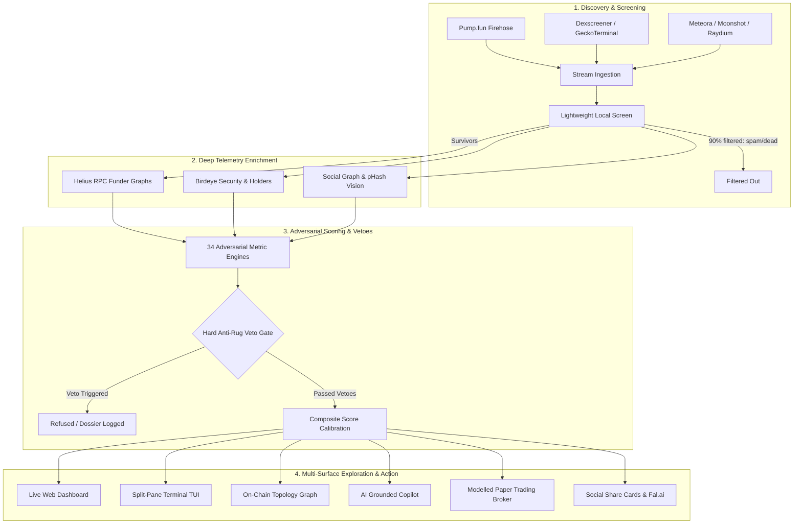

# Botsensai 2.0

> **Adversarial Intelligence, On-Chain Topology Forensics & Quantitative Decision System for Solana Memecoins**

[](https://www.python.org/downloads/)
[](https://opensource.org/licenses/MIT)
[](#-epistemic-honesty--backpressure-gates)
[](#-safety--zero-signing-guarantee)

---

## 🧭 Overview

Standard memecoin APIs only report easily manufactured metrics: *price, volume, liquidity, transaction count, and holder count*. A single operator with a basic bundling script can fabricate 200 holders and 400 transactions before the second chart candle forms.

**Botsensai 2.0** discards vanity numbers and evaluates newly launched tokens against **34 adversarial signals designed around cost-to-fake**. It maps on-chain funder topologies, tracks deployer history, analyzes social remix depth, performs point-in-time walk-forward backtesting, executes convex paper trading, and provides rich interactive dashboards, visual topology explorers, and an AI intelligence copilot.

---

## 🏛 System Architecture



---

## ⚡ Instant Zero-Config Quickstart

### 1. Installation

```bash
git clone https://github.com/FritzHeider/Botsensai-Agentic.git
cd Botsensai
pip install -e ".[dev]"
```

*Optional extras:*
- `pip install -e ".[browser]"` + `playwright install chromium` (Headless X scraping)
- `pip install -e ".[ml]"` (Scikit-learn & LightGBM signal weight calibration)

### 2. Launch the Onboarding Wizard

```bash
botsensai wizard
```
*Verifies system prerequisites, checks RPC reachability, audits API credentials, and validates configuration syntax.*

### 3. Run the 60-Second Interactive Demo

```bash
botsensai demo
```
*Executes an automated, self-contained simulation comparing an organic runner (`$GIGAWHALE`) against a sybil-bundled rug (`$PEPERUG`) with live telemetry ingestion, adversarial scoring, and paper trade execution.*

---

## 🌟 Core Features & Command Reference

### 🎨 1. Live Visual Interfaces & Exploration

| Command | Description | Interface |
| :--- | :--- | :--- |
| `botsensai ui --port 8000` | Launch real-time dark glassmorphic HTML5 web dashboard with WebSocket candidate stream and SVG radar charts. | Browser (`http://localhost:8000`) |
| `botsensai graph <mint>` | Interactive D3.js force-directed network graph rendering deployer wallets, upstream funding trees, and sybil clusters. | Browser / Graph UI |
| `botsensai tui` | Split-pane Rich Live terminal interface displaying discovery streams, live paper positions, and signal audits. | Terminal TUI |
| `botsensai autopsy <mint>` | Forensic post-mortem timeline tracing chronological events (trades, liquidity shifts, vetoes) of a token. | Terminal / Markdown |
| `botsensai compare <m1> <m2>` | Side-by-side metric audit comparing runner vs rug tokens across all 34 signals. | Terminal Table |
| `botsensai gallery <mint>` | Perceptual image hashing (`pHash`) clustering and Originality Index calculation across launch memes. | Terminal / Media |

### 🤖 2. Interactive Intelligence & Copilot

| Command | Description | Interface |
| :--- | :--- | :--- |
| `botsensai ask <mint> "<question>"` | Point-in-time grounded AI Copilot explaining token safety, veto rationale, and metrics with citations. | Natural Language |
| `botsensai share <mint>` | Generates high-resolution (1200x675) SVG infographic share cards with speedometer gauges and radar polygons. | SVG / Fal.ai |
| `botsensai sandbox` | Strategy parameter sensitivity grid simulating threshold and stop-loss trade-offs against historical cohorts. | Terminal Grid |
| `botsensai playground` | Gamified training simulator challenging operators against adversarial launch scenarios with outcome scoring. | Interactive CLI |

### 📊 3. Quantitative Depth & Research Lab

| Command | Description | Interface |
| :--- | :--- | :--- |
| `botsensai smart-money` | Discovers profitable, unaffiliated early buyer wallets ($\ge 60\%$ win-rate) preserving strict PIT integrity. | Terminal Table |
| `botsensai replay <mint>` | Second-by-second historical tape player animating telemetry evolution and exact veto trigger timings. | Terminal Animation |
| `botsensai digest` | Compiles comprehensive Markdown/HTML executive market intelligence and alpha briefings. | Markdown / HTML |
| `notebooks/` | Pre-built Jupyter notebooks for Signal Exploration, Walk-Forward Backtesting, and Funder Forensics. | Jupyter Lab |

### ⚡ 4. Developer Experience & Ecosystem

| Command | Description | Interface |
| :--- | :--- | :--- |
| `botsensai snipe` | Discover active bonding curves, score candidates, and snipe the current #1 best token in paper mode. | Simulated Execution |
| `botsensai serve --port 8001` | Programmatic headless REST and WebSocket API server with OpenAPI / Swagger documentation (`/docs`). | REST API / WS |
| `botsensai corpus export` | Packages SQLite databases, telemetry records, and weights into compressed `.tar.gz` archive snapshots. | Tarball Archive |
| `botsensai sweep` | Executes a single live discovery, screening, enrichment, and scoring pass over active Solana launchpads. | CLI Engine |
| `botsensai run` | Runs the continuous multi-feed background streaming supervisor and paper trading broker. | Daemon Runner |

---

## 🔬 The 34 Adversarial Signals (Cost-to-Fake Thesis)

Every metric in Botsensai is strictly evaluated on its **cost to fake** and requires mandatory gameability documentation:

```
Family                   Count  Core Question Answered
─────────────────────────────────────────────────────────────────────────────────────────────
onchain_topology             7  How many independent human actors fund this holder set?
social_authenticity          9  Did 400 distinct people engage, or 1 person with 400 bots?
community_production         5  Has anyone unpaid created original remix art or video?
narrative                    5  Is the cultural idea novel, search-trending, and unique?
team_credibility             4  What is the deployer's on-chain history and current bag action?
execution_quality            4  Could our target position size realistically be exited?
```

### Signal Family Details

#### 1. On-Chain Topology & Funder Graphs (`onchain_topology`)
- **`funder_tree_entropy`**: Shannon entropy of upstream wallet funding sources (detects single-source deployer distribution).
- **`top10_clean_share`**: Holder concentration excluding AMM vaults, bonding curve accounts, and burned addresses.
- **`sybil_cluster_coefficient`**: Graph clustering coefficient across early transaction graphs.
- **`co_funder_dispersion`**: Shared upstream funding links among top 20 non-deployer holders.
- **`bundle_snipe_share`**: Percentage of supply acquired in slot 0/1 atomic Jito bundles.
- **`deployer_prior_rugs`**: Historical count of deployer-associated tokens that pulled liquidity or dumped.
- **`deployer_funded_ratio`**: Fraction of early buyers funded directly or transitively by the deployer wallet.

#### 2. Social Authenticity & Sybil Defense (`social_authenticity`)
- **`reply_template_ratio`**: Levenshtein edit distance clustering across social replies (catches comment bots).
- **`engager_age_dispersion`**: Account creation date variance among social engagers.
- **`follower_credibility_ratio`**: Ratio of high-reputation accounts to newly minted spam followers.
- **`bookmark_to_like_ratio`**: Organic utility ratio (botnets rarely buy bookmarks).
- **`reply_to_retweet_ratio`**: Discussion density vs automated retweet amplifier scripts.
- **`video_view_authenticity`**: View-to-engagement proportions on video platforms.
- **`channel_call_lead_time`**: Telegram call channel median lead time to subsequent peak multiple.
- **`x_account_creation_gap`**: Time elapsed between token concept creation and official account registration.
- **`social_co_mention_velocity`**: Organic social mention acceleration across independent profiles.

#### 3. Community Production & Meme Lineage (`community_production`)
- **`original_art_count`**: Unpaid distinct visual assets produced by non-team accounts.
- **`meme_remix_depth`**: Perceptual hash (`pHash`) clustering detecting novel artistic adaptations.
- **`video_remix_count`**: Short-form video edits and animations generated for the token.
- **`ugc_ratio`**: Percentage of total media output created by community members.
- **`phash_cluster_size`**: Visual lineage tree branching and originality index.

#### 4. Narrative & Search Momentum (`narrative`)
- **`topic_novelty`**: Semantic novelty compared to historical meme themes.
- **`search_velocity`**: Search query acceleration and trend breakout magnitude.
- **`ticker_contention`**: Multi-token symbol collisions launched within a short time window.
- **`cultural_relevance`**: External cultural event correlation and news resonance.
- **`domain_age_ratio`**: Registered domain age relative to token deployment timestamp.

#### 5. Team Credibility & Insider Overhang (`team_credibility`)
- **`deployer_retention_rate`**: Deployer initial token allocation holding curve over time.
- **`deployer_sol_commitment`**: SOL spent by deployer on their own token bonding curve at $t_0$.
- **`insider_supply_overhang`**: Total supply controlled by deployer, snipers, and co-funded addresses.
- **`deployer_velocity`**: Time elapsed since deployer's previous launch attempt.

#### 6. Execution Quality & Liquidity Realizability (`execution_quality`)
- **`exit_depth_native`**: Liquidity available to absorb a 0.25 SOL exit with $< 500$ bps slippage.
- **`bonding_curve_progress`**: Percentage completion along the bonding curve toward Raydium graduation.
- **`sandwich_risk_ratio`**: Historical MEV sandwich activity on the token's trading pool.
- **`realizable_peak_multiple`**: Net attainable exit multiple after deducting integral curve impact and fees.

---

## 🛡 Epistemic Honesty & Backpressure Gates

Botsensai includes an automated quality assurance harness enforcing **9 strict verification gates**:

```bash
python scripts/backpressure.py
```

```text
Backpressure gates

  PASS  tests        pass     603 passed, 0 failed, 0 errors
  PASS  lint         pass     ruff over src tests scripts: All checks passed!
  PASS  typecheck    pass     mypy over src: Success: no issues found in 88 source files
  PASS  audit        pass     No known dependency vulnerabilities found
  PASS  coverage     pass     81% of statements (floor 55%)
  PASS  complexity   10       worst 10 (src/botsensai/supervisor.py); 1117 functions, 0 over 10
  PASS  duplication  pass     1.8% of lines in repeated blocks
  PASS  performance  pass     3 query-plan guards passed; no hot read path full-table scans
  PASS  specs        pass     34 metrics registered (floor 32)

9/9 green
```

### Core Integrity Guarantees

1. **Point-In-Time Correctness**: All training, backtesting, and evaluation queries enforce `as_of <= decision_time` and `observed_at <= decision_time`. Information leaks from the future are structurally impossible.
2. **Absence is Never Bearishness**: Missing metric data produces `MISSING` (`None`), never `0.0`. Defaulting missing data to zero falsely penalizes unscraped tokens.
3. **Safety Vetoes are Hard Refusals**: Critical red flags (insider supply $> 30\%$, deployer rugs $> 0$, honeypot transfer tax) short-circuit scoring immediately.
4. **Realistic Modeled Execution**: Every paper trade and backtest order calculates constant-product curve integrals, priority fees, Jito tips, execution latency, and sandwich penalties.
5. **Zero-Signing Guarantee**: There is **no transaction signing or private key loading code** anywhere in the repository (`test_repository_contains_no_signing_code` enforces this).

---

## 📁 Repository Structure

```text
Botsensai/
├── src/botsensai/
│   ├── api.py                   # Headless REST & WebSocket API Server (/api/v1)
│   ├── autopsy.py               # Token autopsy forensic timelines & comparisons
│   ├── bot.py                   # Interactive Telegram/Discord slash commands
│   ├── cli.py                   # Unified Typer CLI entrypoint
│   ├── copilot.py               # Grounded natural language AI token explainer
│   ├── corpus_sync.py           # Database & weight snapshot bundle sync
│   ├── demo.py                  # Zero-config 60-second interactive demo runner
│   ├── digest.py                # Executive alpha digest generator
│   ├── inspector.py             # Single-token deep forensic auditor
│   ├── onboarding.py            # Guided interactive setup & readiness wizard
│   ├── replay.py                # Historical tape replay player & visualizer
│   ├── sandbox.py               # Strategy parameter sensitivity explorer
│   ├── smart_money.py           # PIT-compliant profitable wallet discovery
│   ├── tui.py                   # Split-pane Rich Live terminal dashboard
│   ├── backtest/                # Walk-forward backtester & bootstrap engine
│   ├── collectors/              # Launchpad, DEX, RPC, and social scraping adapters
│   ├── dashboard/               # FastAPI live server, D3.js topology graph, and web UI
│   ├── execution/               # Realistic order simulation, fees, and paper broker
│   ├── media/                   # Fal.ai social cards, pHash clustering, and gallery
│   ├── metrics/                 # 34 adversarial metric engines and Plugin SDK
│   ├── models.py                # Pydantic core domain models
│   └── store/                   # SQLite PIT database store & indexes
├── notebooks/                   # Pre-built research lab Jupyter notebooks
├── tests/                       # 603 comprehensive automated unit & property tests
├── config/                      # Configuration defaults and calibrated weights
└── scripts/                     # Backpressure gates, audit, and benchmark tools
```

---

## 📄 License

MIT License. Engineered for open quantitative research, on-chain safety, and adversarial market intelligence.
