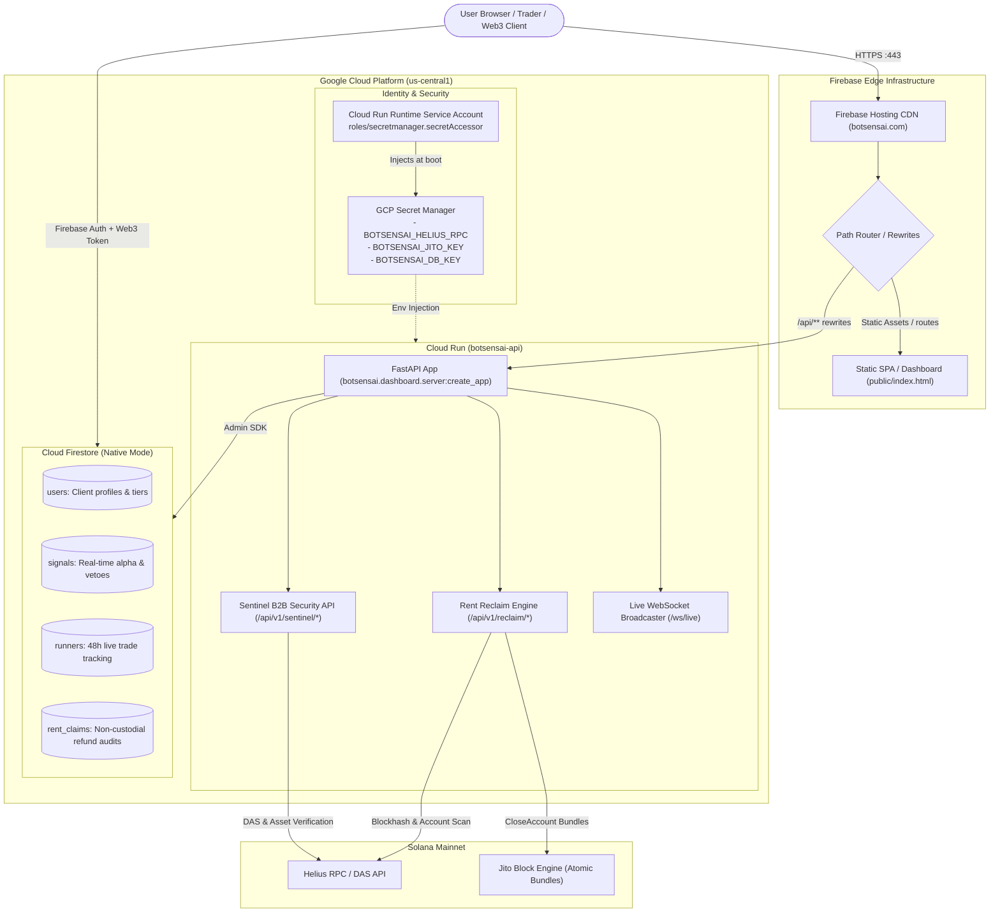
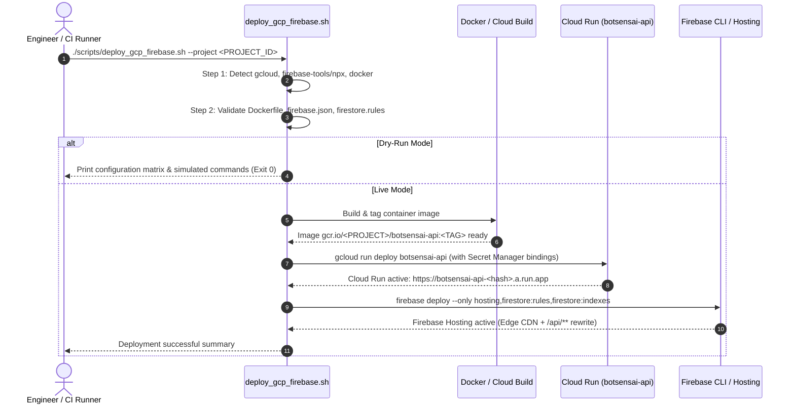

# Botsensai Cloud & Firebase Migration Guide

This guide details the production architecture, security posture, deployment automation, and configuration standards for deploying Botsensai to Google Cloud Platform (GCP) and Firebase.

---

## 1. System Architecture

Botsensai operates as a hybrid edge and serverless quantitative trading and intelligence platform:



---

## 2. Infrastructure Components

### A. Static Single-Page Portal & Firebase Hosting
- **Asset Directory**: `public/` containing `index.html` (lightweight, zero-build, Tailwind CSS dark theme).
- **Edge Routing**: All static web traffic hits Firebase Hosting Edge PoPs globally with HTTP/3 support.
- **Rewrites**:
  - `/api/**` $\rightarrow$ proxied directly to Cloud Run service `botsensai-api` in `us-central1`.
  - `**` $\rightarrow$ `/index.html` for client-side single page navigation.
- **Enterprise Security Headers**: Configured in `firebase.json`:
  - `X-Frame-Options: DENY` (clickjacking defense)
  - `X-Content-Type-Options: nosniff` (MIME sniffing defense)
  - `Referrer-Policy: strict-origin-when-cross-origin`
  - `Strict-Transport-Security: max-age=31536000; includeSubDomains; preload`
  - `Permissions-Policy: camera=(), microphone=(), geolocation=()`

### B. Cloud Run Container Service (`botsensai-api`)
- **Runtime**: Python 3.11-slim container on Cloud Run Gen 2.
- **Container Security**: Runs under a non-root system user (`appuser`, UID `1000`) with no privileges.
- **Healthcheck & Probes**: Standard liveness/readiness probes targeting `/health` and `/api/health` on port `8080`.
- **Concurrency & Scaling**:
  - **Memory**: `2Gi` (optimized for vectorized numpy/pandas operations and solders transaction serialization).
  - **CPU**: `2 vCPU`.
  - **Concurrency**: `80` requests per instance.
  - **Min Instances**: `0` (or `1` for production zero-latency trade routing).
  - **Max Instances**: `10` (budget guardrail).

---

## 3. GCP Secret Manager Integration

Trading keys, private keypairs, and RPC endpoints must never be baked into container images or checked into version control.

### Required Secrets
| Secret ID | Description | Consumption |
| :--- | :--- | :--- |
| `BOTSENSAI_HELIUS_RPC` | Helius Mainnet RPC & DAS API URL | Injected as `SOLANA_RPC_URL` |
| `BOTSENSAI_JITO_KEY` | Jito Block Engine authentication key | Injected as `JITO_AUTH_KEY` |
| `BOTSENSAI_DB_KEY` | Database encryption / signing key | Injected as `BOTSENSAI_DB_KEY` |

### Setting Up Secrets in GCP
```bash
# 1. Enable Secret Manager API
gcloud services enable secretmanager.googleapis.com --project <PROJECT_ID>

# 2. Create secrets
gcloud secrets create BOTSENSAI_HELIUS_RPC --replication-policy="automatic" --project <PROJECT_ID>
gcloud secrets create BOTSENSAI_JITO_KEY --replication-policy="automatic" --project <PROJECT_ID>
gcloud secrets create BOTSENSAI_DB_KEY --replication-policy="automatic" --project <PROJECT_ID>

# 3. Add secret payloads
echo -n "https://mainnet.helius-rpc.com/?api-key=YOUR_API_KEY" | \
  gcloud secrets versions add BOTSENSAI_HELIUS_RPC --data-file=- --project <PROJECT_ID>

echo -n "YOUR_JITO_KEYPAIR_BASE58" | \
  gcloud secrets versions add BOTSENSAI_JITO_KEY --data-file=- --project <PROJECT_ID>

openssl rand -hex 32 | \
  gcloud secrets versions add BOTSENSAI_DB_KEY --data-file=- --project <PROJECT_ID>
```

### IAM Permissions for Cloud Run
Grant the Cloud Run runtime service account access to read secrets:
```bash
PROJECT_NUMBER=$(gcloud projects describe <PROJECT_ID> --format='value(projectNumber)')
RUN_SERVICE_ACCOUNT="${PROJECT_NUMBER}-compute@developer.gserviceaccount.com"

gcloud secrets add-iam-policy-binding BOTSENSAI_HELIUS_RPC \
  --member="serviceAccount:${RUN_SERVICE_ACCOUNT}" \
  --role="roles/secretmanager.secretAccessor" \
  --project <PROJECT_ID>

gcloud secrets add-iam-policy-binding BOTSENSAI_JITO_KEY \
  --member="serviceAccount:${RUN_SERVICE_ACCOUNT}" \
  --role="roles/secretmanager.secretAccessor" \
  --project <PROJECT_ID>

gcloud secrets add-iam-policy-binding BOTSENSAI_DB_KEY \
  --member="serviceAccount:${RUN_SERVICE_ACCOUNT}" \
  --role="roles/secretmanager.secretAccessor" \
  --project <PROJECT_ID>
```

When deploying Cloud Run, Secret Manager references are mounted directly as environment variables:
```bash
--set-secrets="SOLANA_RPC_URL=projects/${PROJECT_ID}/secrets/BOTSENSAI_HELIUS_RPC:latest,JITO_AUTH_KEY=projects/${PROJECT_ID}/secrets/BOTSENSAI_JITO_KEY:latest,BOTSENSAI_DB_KEY=projects/${PROJECT_ID}/secrets/BOTSENSAI_DB_KEY:latest"
```

---

## 4. Firestore Security Model & Rules

The Firestore security model is defined in `firestore.rules` and indexed via `firestore.indexes.json`.

### Collection Access Matrix

| Collection | Path Pattern | Read Access | Write Access | Key Validation / Hardening |
| :--- | :--- | :--- | :--- | :--- |
| `users` | `/users/{userId}` | Owner only (`auth.uid == userId`) | Client: Create (`tier == 'free'`) & Self-Update. Delete: Disabled. | Client cannot mutate `tier` or self-assign `apiKey`. |
| `signals` | `/signals/{signalId}` | Authenticated subscribers | **Disabled** (Server Admin SDK only) | Immutable real-time signal stream. |
| `runners` | `/runners/{runnerId}` | **Public** | **Disabled** (Server Admin SDK only) | Verifiable 48h track record performance. |
| `rent_claims` | `/rent_claims/{claimId}` | Owner only (`userId == auth.uid` or wallet match) | Authenticated creator matching wallet/UID. Update/Delete: Disabled. | Immutable non-custodial audit log. Protected from arbitrary enumeration. |
| Default | `/{document=**}` | **Deny All** | **Deny All** | Default-closed security posture. |

### Security Hardening Highlights
1. **Rent Claims Authorization Scope**: Fixed an issue where `isOwner(request.auth.uid)` previously evaluated to `true` for all authenticated users, potentially allowing tenant data cross-contamination. Reads and creates are now strictly bound to `resource.data.userId == request.auth.uid` or `resource.data.wallet == request.auth.token.wallet`.
2. **B2B API Key Isolation**: Client users cannot inject or alter `apiKey` fields in Firestore; keys must be provisioned through administrative backend workflows.
3. **Composite Queries**: Defined compound indexes in `firestore.indexes.json` for:
   - `signals`: `(score DESC, createdAt DESC)`, `(regime ASC, score DESC)`, `(regime ASC, createdAt DESC)`
   - `runners`: `(peakMultiple DESC, openedAt DESC)`
   - `rent_claims`: `(wallet ASC, createdAt DESC)`, `(userId ASC, createdAt DESC)`

---

## 5. Automated Deployment with `deploy_gcp_firebase.sh`

The unified deployment script [`scripts/deploy_gcp_firebase.sh`](file:///Users/drop/.gemini/antigravity/worktrees/Botsensai/aws_project_control_setup/scripts/deploy_gcp_firebase.sh) automates tool discovery, configuration validation, container deployment, and Firebase publication.

### Syntax
```bash
./scripts/deploy_gcp_firebase.sh [OPTIONS]
```

### Supported Flags
- `--dry-run`: Runs full local verification without mutating remote resources (validates tools, JSON files, security rules, and outputs simulated commands).
- `--project <PROJECT_ID>`: Sets the target GCP and Firebase project ID.
- `--region <REGION>`: Sets the Cloud Run region (default: `us-central1`).
- `--service-name <NAME>`: Cloud Run service name (default: `botsensai-api`).
- `--only-cloudrun`: Builds and deploys only the Cloud Run API service.
- `--only-firebase`: Deploys only Firebase Hosting, Firestore rules, and Firestore indexes.
- `--skip-docker`: Dispatches container builds to Google Cloud Build (`--source .`) instead of the local Docker daemon.
- `--docker-test`: Executes a local Docker build test in dry-run mode.

### Execution Workflow



---

## 6. Verification & Operational Runbook

### Dry-Run Verification
Verify your configuration locally prior to triggering any deployment:
```bash
./scripts/deploy_gcp_firebase.sh --dry-run
```
Expected output:
```
[SUCCESS] DRY-RUN VERIFICATION COMPLETED SUCCESSFULLY
  ✔ All toolchains (gcloud, firebase-tools/npx, docker) detected and functional
  ✔ Dockerfile syntax, non-root user, and healthcheck verified
  ✔ firebase.json syntax, Cloud Run rewrites, and security headers verified
  ✔ firestore.rules verified with strict RBAC and rent_claims security fix
  ✔ firestore.indexes.json verified with composite indexes
  ✔ GCP Secret Manager environment binding specs validated
```

### Healthcheck & Live Smoke Testing
Once deployed, verify service connectivity:
```bash
# Direct Cloud Run Service
curl -f https://<SERVICE_NAME>-<HASH>.run.app/health
curl -f https://<SERVICE_NAME>-<HASH>.run.app/api/health

# Via Firebase Hosting Edge Proxy
curl -f https://botsensai.com/api/health
curl -f https://botsensai.com/api/v1/sentinel/scan/EPjFWdd5AufqSSqeM2qN1xzybapC8G4wEGGkZwyTDt1v
```

### Traffic Splitting & Canary Deployments
To test a new container revision with 10% traffic:
```bash
gcloud run services update-traffic botsensai-api \
  --to-revisions=botsensai-api-00002-xyz=10 \
  --project <PROJECT_ID> \
  --region us-central1
```

### Monitoring & Cloud Logs
Tail real-time container logs:
```bash
gcloud logging tail "resource.type=cloud_run_revision AND resource.labels.service_name=botsensai-api" \
  --project <PROJECT_ID>
```
